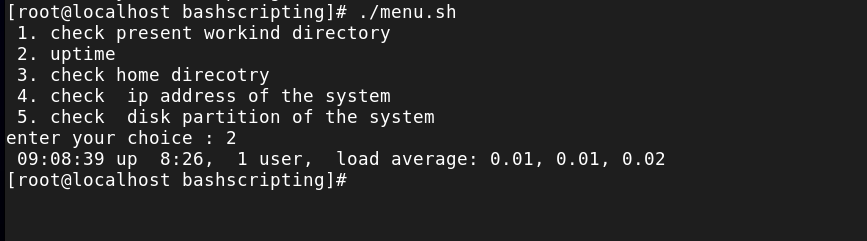

---
# 🛡️ Cybersecurity Bash Automation Toolkit

A growing collection of **Bash-based automation scripts** focused on system monitoring, security checks, and penetration testing support.

This repository demonstrates practical use of Linux commands, scripting logic, and real-world cybersecurity automation.

---

## 🚀 Project Overview

This project is continuously updated as I learn and implement new Bash scripting concepts.
Each script is designed with a **real-world security or system administration use case**.

---

## 📂 Repository Structure

```bash
Cybersecurity-Bash-Automation-Toolkit/
│
├── scripts/            # Bash automation scripts
├── screenshots/        # Execution proof images
└── README.md           # Documentation
```

---

## 🧰 Scripts Included

### 🔐 System Information & Recon Menu (`menu.sh`)

* Check present working directory
* Monitor system uptime
* Audit home directory
* Display IP configuration
* View disk partitions using `lsblk`

---

## ▶️ How to Run

```bash
# Give permission
chmod +x menu.sh

# Run script
./menu.sh
```

---

## 📸 Screenshots

### 1️⃣ Creating Script in Vim


### 2️⃣ Adding Code in Vim


### 3️⃣ Setting Permissions (chmod)


### 4️⃣ Script Execution Output


### 5️⃣ Menu Option 1


### 6️⃣ Menu Option 2



### 7️⃣ Menu Option 4 (Hide Option)


---

## 🎯 Learning Objectives

* Understand **Bash scripting fundamentals**
* Work with **case statements & user input**
* Automate **security & system admin tasks**
* Build a **portfolio-ready cybersecurity project**

---

## 🔒 Cybersecurity Use Cases

* Quick system reconnaissance
* Network configuration checks
* Disk & storage monitoring
* Automating repetitive CLI tasks

---

## 🚀 Future Enhancements

* 📡 Nmap automation scripts
* 🔍 API reconnaissance tools
* 📋 Advanced menu-driven tools
* 📊 Log analysis & reporting

---

## 👨‍💻 Author

**Sunny Dange**
Cyber Security | VAPT | Linux | Networking

* 🔗 GitHub: [https://github.com/DANGESUNNY20](https://github.com/DANGESUNNY20)
* 🔗 LinkedIn: [https://www.linkedin.com/in/sunnydange](https://www.linkedin.com/in/sunnydange)

---

## ⭐ Note

This repository is actively maintained as part of my journey in **Bash scripting and cybersecurity automation**.

---


